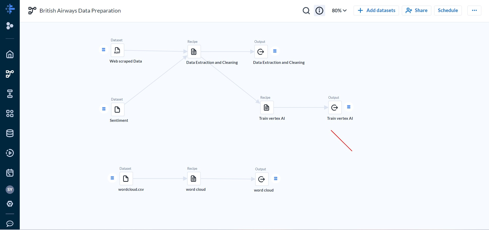

# British Airways Customer Reviews 
## Sentiment Analysis Dashoard 
### Objective:-
#### Task1:-
The Objective of this project is to web scrape review data from the web and perform sentiment analysis using Google Cloud NLP API and present Insights .
#### Task2:-
The objective is to built a predictive model to analyze the customers purchasing behaviour using historical Data .
### Dataset to Be used
The customer reviews for this project can be extracted using [skytrax](https://www.airlinequality.com/airline-reviews/british-airways)
### Technologies used :
1. Google cloud storage
2. Google cloud NLP API
3. Google colab
4. Dataprep by Trifacta
5. Looker
### ETL workflow :
#### [steps](flow_British_Airways_Data_Preparation.json5)
#### 

### Sentiment analysis & entity extraction [code](Sentiment_Analysis_via_API.ipynb)
### Dashboard

<iframe width="900" height="1200" src="https://lookerstudio.google.com/embed/reporting/c3bcb6e8-1b53-4ae2-9079-37d681061114/page/yudqD" frameborder="0" style="border:0" allowfullscreen sandbox="allow-storage-access-by-user-activation allow-scripts allow-same-origin allow-popups allow-popups-to-escape-sandbox"></iframe>

### Insights :-
1. 70% of the reviews are negative for British Airways .
2. Average customer ratinng for airlines is 5 out of 10.
3. The services was worst from 2016-2018.
4. Positive reviews were high before 2016 then decreased.
5. Most of the negative review are from couples and solo travelling in economic class.
6. Majority of negative reviews related to airline process and product offered .
7. Other issue are related to Travel & travelogues and customer protection.

